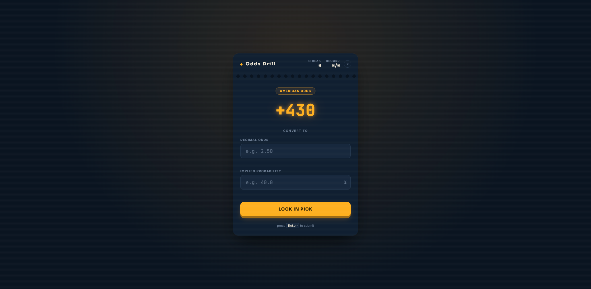

# Odds Drill

A single-file browser game for practicing conversions between the three ways gambling odds get quoted: **American odds**, **decimal odds**, and **implied probability**.

## How to play

1. Open [`index.html`](index.html) in a browser — no build step or server required.
2. You're shown a value in one format (e.g. American odds `+150`).
3. Convert it to the other two formats and enter your answers.
4. Click **Lock In Pick** (or press Enter) to check your work. Each field is marked correct or incorrect, and the correct value is shown for any miss.
5. Click **Next Round →** to get a new question.

Your **Streak** and **Record** are tracked at the top and saved in the browser (`localStorage`), so they persist across reloads. Use the reset button (↺) next to them to zero both out.

## Conversion reference

Every question is generated from a random American odds value, and the other two formats are derived from it, so the three numbers are always mutually consistent:

- **American → Decimal**
  - Positive: `decimal = (american / 100) + 1`
  - Negative: `decimal = (100 / |american|) + 1`
- **Decimal → Implied Probability**
  - `probability = 1 / decimal`

Answers are accepted within a small tolerance (±1 for American, ±0.02 for decimal, ±0.3% for probability) to allow for reasonable manual rounding.

## Tech

Plain HTML, CSS, and vanilla JavaScript — no dependencies, no build tools.
